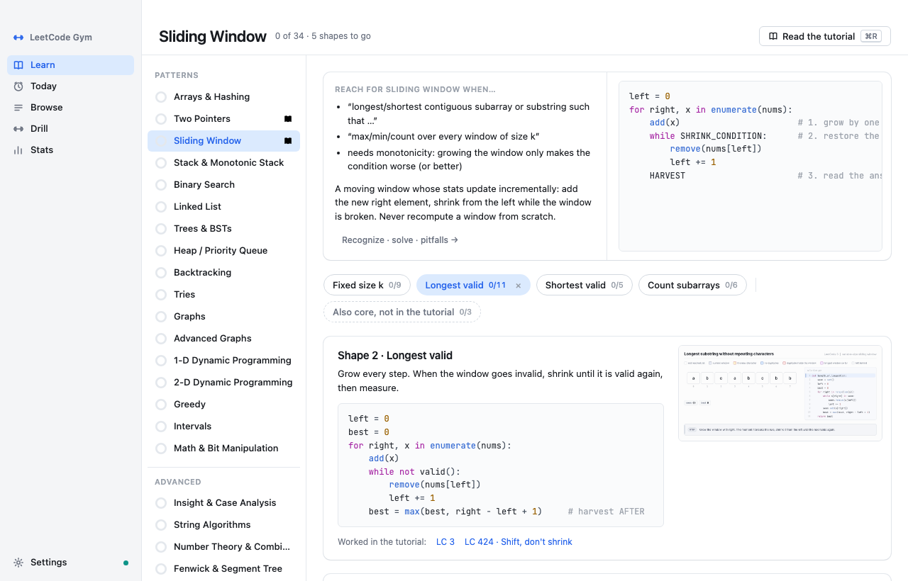
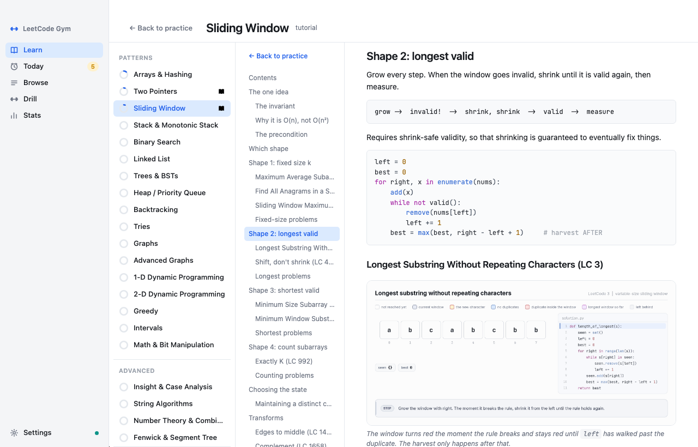
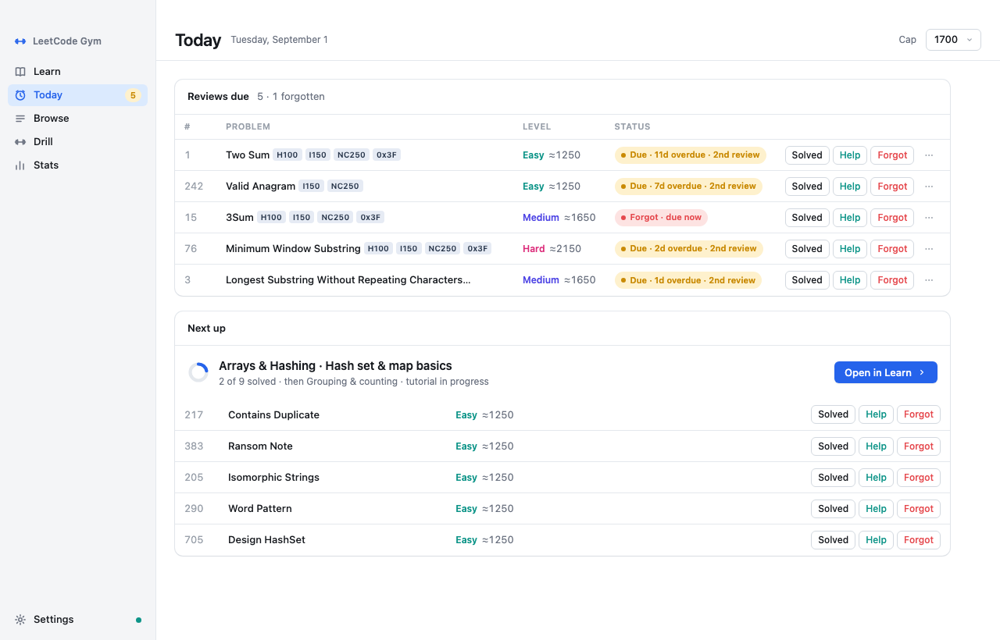
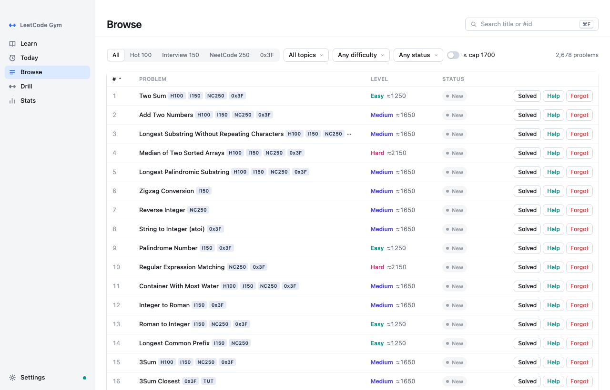
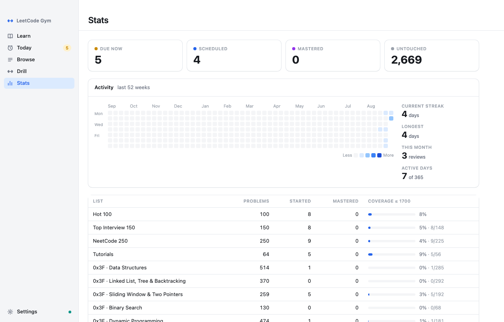

# LeetCode Gym

A desktop app for interview prep that treats LeetCode like a gym: **learn** one pattern
at a time from a hand-written tutorial, **drill** random problems with the type hidden
until you commit, and let a **forgetting-curve scheduler** bring each problem back right
before you would forget it. Runs as a native macOS/Windows app; nothing to install.



[](https://github.com/guangboyu/leetcode-study-tracker/actions/workflows/ci.yml)
[](https://github.com/guangboyu/leetcode-study-tracker/releases/latest)
[](LICENSE)
[](#run-from-source)

## Download

| Platform | File | |
|---|---|---|
| macOS 11+ | `LeetCode-Gym.dmg` | [Download](https://github.com/guangboyu/leetcode-study-tracker/releases/latest/download/LeetCode-Gym.dmg) |
| Windows 10/11 | `LeetCode Gym.exe` | [Download](https://github.com/guangboyu/leetcode-study-tracker/releases/latest) |

**macOS:** open the DMG, drag *LeetCode Gym* to Applications, then right-click → **Open**
the first time (the app is not code-signed). If macOS says the app is damaged, run
`xattr -dr com.apple.quarantine "/Applications/LeetCode Gym.app"` once.
**Windows:** double-click the exe; if SmartScreen appears, *More info → Run anyway*.

## How to practice

1. **Learn a pattern.** Open *Learn*, pick the next pattern in the list, read its
   tutorial (animated walkthroughs, a template you can copy, the pitfalls), then solve
   the problems in the order the tutorial lists them — every table is live, so you mark
   *Solved / Help / Forgot* right there. When the core problems are done, expand
   *Extend with 0x3F* for more of the same shape within your rating cap.
2. **Drill cold.** *Drill* draws a random untouched problem inside a rating range with
   its type hidden. Decide the approach *before* you reveal or mark — that is the skill
   interviews test. Narrow the pool to Hot 100 + Top Interview 150 + NeetCode 250 for
   most companies; add 0x3F when you want depth.
3. **Keep it.** *Today* lists what is due. Each solve pushes the next review out along
   an Ebbinghaus ladder (1 → 2 → 4 → 7 → 15 → 30 days); six clean reviews and the
   problem is mastered. *Forgot* restarts the ladder, *Help* holds it and brings the
   problem back in two days. Every mark can be undone (⌘Z).

## What is in the app

| | |
|---|---|
|  |  |
| **Learn → tutorial.** Your own markdown rendered in-app: table of contents, GIF animations, highlighted code, live problem tables. | **Today.** Reviews due, sorted by how overdue, then the next subtopic to work on. |
|  |  |
| **Browse.** All 2,678 problems from four lists; filter, sort, search (⌘F). | **Stats.** Activity heatmap, streaks, coverage per list. |

- **Learn** — one ordered route of 21 patterns (arrays & hashing → two pointers →
  sliding window → … → DP → greedy → intervals → math & bits, plus four advanced
  ones). Patterns with a written tutorial show a book mark; the rest use a curated
  recognize/solve card until their tutorial lands. Tutorials so far: Sliding Window,
  Two Pointers — see [`tutorials/README.md`](tutorials/README.md) for the status table.
- **Drill** — random, type-blind, rating-ranged; no repeats within the last ten draws.
- **Settings** — progress folder (point it at Dropbox/iCloud to sync machines; histories
  merge losslessly), rating cap, appearance (system / light / dark), keyboard shortcuts.

The whole app is keyboard-driven: ⌘1–5 switch views, ⌘F searches, ⌘, opens Settings,
⌘/ shows every shortcut; in tables `j`/`k` move, `s`/`h`/`f` mark, `Enter` opens the
problem on LeetCode.

## The lists

| List | Problems | Notes |
|---|---|---|
| [LeetCode Hot 100](source/Hot100.md) | 100 | Official study plan |
| [LeetCode Top Interview 150](source/Leetcode150.md) | 150 | Official study plan |
| [NeetCode 250](source/Neetcode250.md) | 250 | NeetCode 150 plus 100 more |
| [0x3F (灵茶山艾府)](source/ox3F/) | 2,346 | 12 topic lists, interview-tier sections, translated |

Problems are keyed by leetcode.com slug and tagged with the lists they belong to, so one
review counts everywhere. Most carry a contest rating (~1000–3000, from zerotrac); the
rest get a difficulty-based estimate shown as `≈`.

Lists by [LeetCode](https://leetcode.com), [NeetCode](https://neetcode.io) and
[灵茶山艾府 / EndlessCheng](https://github.com/EndlessCheng); ratings by
[zerotrac](https://zerotrac.github.io/leetcode_problem_rating/). This repository
redistributes factual list data (ids, titles, groupings) with attribution — no problem
statements, no solutions. The tutorials are original writing.

## Run from source

```bash
python3 tracker/server.py          # http://localhost:8765 — standard library only
python3 -m tracker.desktop         # the same app in a native window (pip install pywebview)
python3 -m unittest discover -s tests
```

Progress is stored as an append-only event log (`reviews.jsonl`) plus a derived
snapshot; preferences live beside it in `settings.json`. Default location: the folder
chosen in Settings, else `$LEETCODE_TRACKER_DATA`, else an existing `~/LeetCodeTracker`,
else the OS application-support directory. To keep a git-backed backup:

```bash
python3 tracker/server.py --data-dir ~/leetcode-progress --autocommit --push
```

## Build the desktop app

```bash
pip install -r packaging/requirements.txt
bash packaging/build_macos.sh                                  # dist/LeetCode Gym.app + LeetCode-Gym.dmg
powershell -ExecutionPolicy Bypass -File packaging\build_windows.ps1   # dist\LeetCode Gym.exe
```

Releases are built by GitHub Actions: push a `vX.Y.Z` tag and both bundles are attached
to the release.

## Contributing

See [CONTRIBUTING.md](CONTRIBUTING.md) — how the repo is laid out, how to add a tutorial
(the parser and tests will tell you if a table id, GIF or anchor is off), and the data
invariants. Changes are listed in [CHANGELOG.md](CHANGELOG.md).

## License

Code (the app, scripts and tutorials' generator) is [MIT](LICENSE). The problem-list data
remains the work of its upstream curators and is redistributed as factual data with
attribution, not under the MIT grant.
