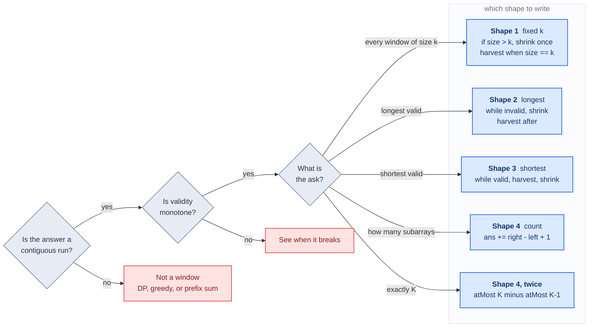
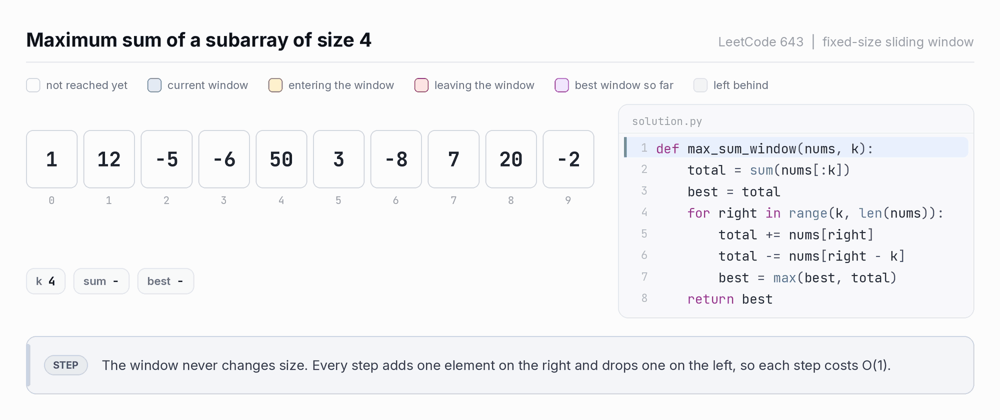
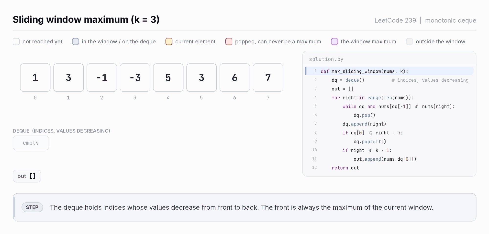
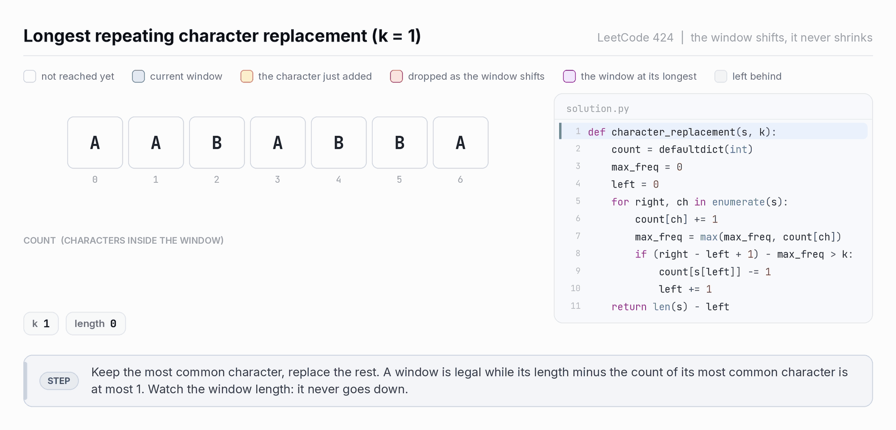
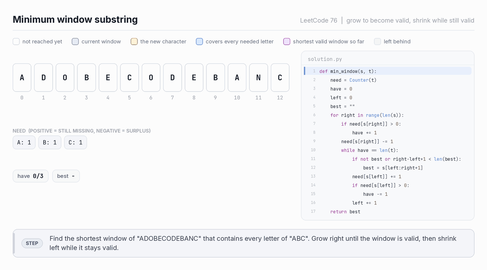
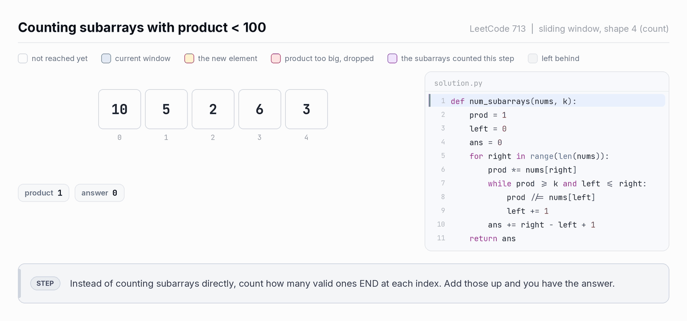
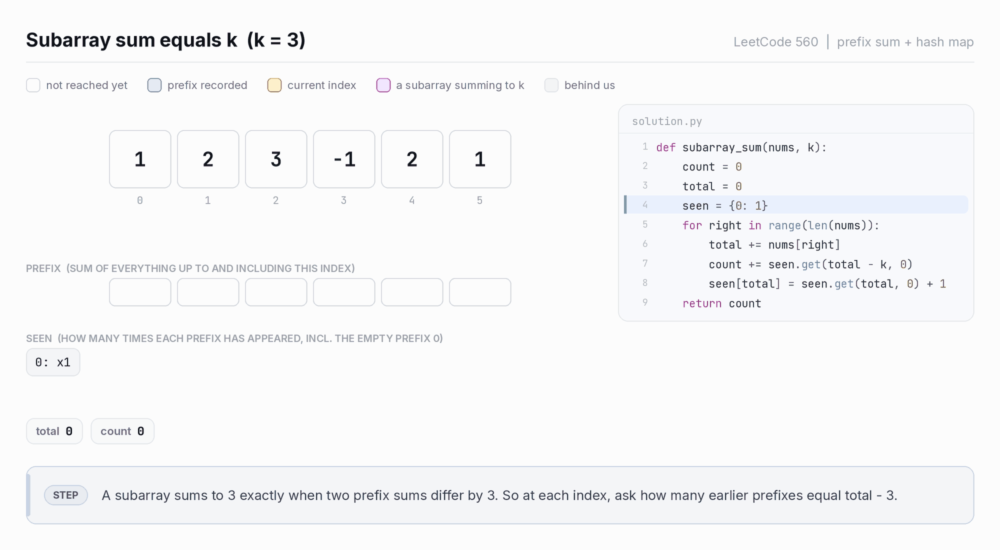

# Sliding Window

A contiguous range `[left, right]` that walks across an array or string, carrying a
small piece of state that always describes exactly what is inside it.

Four shapes. The only thing that separates them is when you shrink.

```
FIXED k        window reaches size k, then slides
               [ 1  3  2 | 6  4 | 8  1 ]
                          l     r          size always k

LONGEST        grow always, shrink only while INVALID
               [ a  b  c  a  b  c  b  b ]
                    l        r            widest valid window seen

SHORTEST       grow always, shrink while still VALID
               [ 2  3  1  2 | 4  3 ]
                             l    r        tightest valid window seen

COUNT          same loop as LONGEST, but harvest a count
               ans += right - left + 1     windows ending at right
```

---

## Contents

- [The one idea](#the-one-idea)
- [Which shape](#which-shape)
- [Shape 1: fixed size k](#shape-1-fixed-size-k)
  - [Maximum Average Subarray I (LC 643)](#maximum-average-subarray-i-lc-643)
  - [Find All Anagrams in a String (LC 438)](#find-all-anagrams-in-a-string-lc-438)
  - [Sliding Window Maximum (LC 239)](#sliding-window-maximum-lc-239)
- [Shape 2: longest valid](#shape-2-longest-valid)
  - [Longest Substring Without Repeating Characters (LC 3)](#longest-substring-without-repeating-characters-lc-3)
  - [Shift, don't shrink (LC 424)](#shift-dont-shrink-lc-424)
- [Shape 3: shortest valid](#shape-3-shortest-valid)
  - [Minimum Size Subarray Sum (LC 209)](#minimum-size-subarray-sum-lc-209)
  - [Minimum Window Substring (LC 76)](#minimum-window-substring-lc-76)
- [Shape 4: count subarrays](#shape-4-count-subarrays)
  - [Exactly K (LC 992)](#exactly-k-lc-992)
- [Choosing the state](#choosing-the-state)
- [Transforms](#transforms)
- [When sliding window breaks](#when-sliding-window-breaks)
- [Pitfalls](#pitfalls)
- [Drills](#drills)
- [Reference card](#reference-card)

---

## The one idea

### The invariant

At the top of every loop iteration, `state` describes `nums[left..right]` exactly.
Nothing more, nothing less.

```
  idx     0   1   2   3   4   5
  nums  [ 2   3   1   2   4   3 ]
                  ^           ^
                left        right

                  |-----------|
                  state describes this range, and only this range
```

`add()` and `remove()` are the only two operations allowed to touch `state`. Every bug
in this pattern is a moment where the invariant quietly stopped holding.

### Why it is O(n), not O(n²)

The inner `while` loop looks expensive. It is not. Across the whole run, `left` moves
forward at most `n` times, because it never moves backward. Same for `right`.

```
right:  ----------------------------->   n moves
left:      -------------------------->   at most n, never backward
                                         total O(n)
```

The moment you want to reset `left` to an earlier index, you have left the pattern.

### The precondition

This is what tells you when *not* to reach for a window.

Call a window valid or invalid by the problem's constraint. Sliding window only works
if validity is monotone in one direction:

| Property | Meaning | Use for | Constraints that look like this |
|---|---|---|---|
| **Shrink-safe** | valid stays valid when you drop elements | longest, count | at most K distinct, no repeats, sum ≤ target with positives, at most K zeros |
| **Grow-safe** | valid stays valid when you add elements | shortest | sum ≥ target with positives, covers all of `t` |

Read shrink-safe backwards and you get the licence to move `left`:

> If `nums[left..right]` is invalid, every window containing it is also invalid.
> So there is no reason to ever look back.

That single sentence is the correctness proof for Shapes 2 and 4.

When neither property holds, the window has no consistent direction to walk in and the
pattern is simply wrong. See [when it breaks](#when-sliding-window-breaks).

---

## Which shape



Every shape fills in the same three slots:

```python
left = 0
for right, x in enumerate(nums):
    add(x)                       # 1. grow by one
    while SHRINK_CONDITION:      # 2. restore the invariant
        remove(nums[left])
        left += 1
    HARVEST                      # 3. read the answer
```

| Shape | Shrink condition | Harvest | Harvest sits |
|---|---|---|---|
| 1. Fixed k | `size > k`, use `if` | `best = f(state)` when `size == k` | after the shrink |
| 2. Longest | `not valid()` | `best = max(best, size)` | after the shrink |
| 3. Shortest | `valid()` | `best = min(best, size)` | **inside**, before shrinking |
| 4. Count | `not valid()` | `ans += right - left + 1` | after the shrink |

`size` is always `right - left + 1`. Write it once and never recompute it inline.

---

## Shape 1: fixed size k

The window grows to size `k` and then slides. One element in, one element out.

```
[ 1  3  2  6  4  8  1 ]     k = 3
  |------|                  full, harvest
     |------|               slide
        |------|            slide
```

Use `if`, not `while`. The window can only overflow by one element per iteration.

### Maximum Average Subarray I (LC 643)



*One element enters on the right, one leaves on the left, and the size never changes. That is why a single `if` is enough.*

```python
def find_max_average(nums: list[int], k: int) -> float:
    total = 0
    best = float("-inf")
    left = 0

    for right, x in enumerate(nums):
        total += x                          # add

        if right - left + 1 > k:            # shrink at most once
            total -= nums[left]
            left += 1

        if right - left + 1 == k:           # harvest only when full
            best = max(best, total)

    return best / k
```

The `== k` guard matters. Without it you record answers from partial windows during the
first `k-1` iterations.

Fixed windows are the one shape where negative numbers are harmless. Nothing depends on
monotonicity, because the window size never varies.

### Find All Anagrams in a String (LC 438)

An anagram of `p` is any window of length `len(p)` whose letter counts match. Comparing
two dicts each step is O(26); tracking a single `matched` integer is O(1).

```python
from collections import Counter

def find_anagrams(s: str, p: str) -> list[int]:
    if len(p) > len(s):
        return []

    need = Counter(p)
    have = Counter()
    matched = 0                             # letters whose counts already agree
    res = []
    k = len(p)

    for right, ch in enumerate(s):
        have[ch] += 1
        if have[ch] == need[ch]:
            matched += 1
        elif have[ch] == need[ch] + 1:      # just overshot
            matched -= 1

        if right >= k:
            out = s[right - k]
            if have[out] == need[out]:      # about to fall below
                matched -= 1
            elif have[out] == need[out] + 1:
                matched += 1
            have[out] -= 1

        if right >= k - 1 and matched == len(need):
            res.append(right - k + 1)

    return res
```

Permutation in String (LC 567) is the same function with an early `return True`.

### Sliding Window Maximum (LC 239)

Still Shape 1, but the state is a monotonic deque instead of a number. Keep indices
whose values are strictly decreasing; the front is always the window maximum.



*An element is popped the moment a larger one arrives to its right, because it can never be the maximum again. The front of the deque is the answer for free.*

```python
from collections import deque

def max_sliding_window(nums: list[int], k: int) -> list[int]:
    dq = deque()          # indices, values decreasing front to back
    out = []

    for right, x in enumerate(nums):
        while dq and nums[dq[-1]] <= x:      # x dominates everything smaller
            dq.pop()
        dq.append(right)

        if dq[0] <= right - k:               # front fell out of the window
            dq.popleft()

        if right >= k - 1:
            out.append(nums[dq[0]])

    return out
```

The outer loop is the fixed-size template; the deque is just the state. What is genuinely
different is the deque's own mechanics: pop from the back on domination, pop from the
front on expiry. Those two rules do not come from the window template and have to be
learned separately.

Amortized O(n), because every index is pushed once and popped at most once.

Store indices, not values. You need the index to know when an element expires.

### Fixed-size problems

| LC | Title | Diff | State | Freq | Note |
|---|---|---|---|---|---|
| 643 | Maximum Average Subarray I | Easy | sum | 🔥🔥 | harvest only when full |
| 1456 | Maximum Number of Vowels in a Substring | Easy | vowel count | 🔥 | cleanest drill for the shape |
| 438 | Find All Anagrams in a String | Med | matched counter | 🔥🔥🔥 | no while loop needed |
| 567 | Permutation in String | Med | matched counter | 🔥🔥 | LC 438 with an early return |
| 239 | Sliding Window Maximum | Hard | monotonic deque | 🔥🔥🔥 | store indices, not values |
| 2461 | Maximum Sum of Distinct Subarrays With Length K | Med | sum + freq | 🔥 | two pieces of state at once |
| 1052 | Grumpy Bookstore Owner | Med | sum | 🔥 | base total plus a window gain |
| 1423 | Maximum Points You Can Obtain from Cards | Med | sum | 🔥🔥 | see [transforms](#transforms) |
| 30 | Substring with Concatenation of All Words | Hard | matched counter | 🔥 | `wordLen` independent windows |

---

## Shape 2: longest valid

Grow every step. When the window goes invalid, shrink until it is valid again, then
measure.

```
grow ->  invalid!  ->  shrink, shrink  ->  valid  ->  measure
```

Requires shrink-safe validity, so that shrinking is guaranteed to eventually fix things.

```python
left = 0
best = 0
for right, x in enumerate(nums):
    add(x)
    while not valid():
        remove(nums[left])
        left += 1
    best = max(best, right - left + 1)     # harvest AFTER
```

### Longest Substring Without Repeating Characters (LC 3)


*The window turns red the moment the rule breaks and stays red until `left` has walked past the duplicate. The harvest only happens after that.*

```python
from collections import defaultdict

def length_of_longest_substring(s: str) -> int:
    count = defaultdict(int)
    best = 0
    left = 0

    for right, ch in enumerate(s):
        count[ch] += 1

        while count[ch] > 1:                # only the NEW char can be a dup
            count[s[left]] -= 1
            left += 1

        best = max(best, right - left + 1)

    return best
```

The loop condition is `count[ch] > 1`, not "the dict has any duplicate." Only the
character you just added can have caused a problem.

Trace on `"abcabcbb"`:

```
r=0  a        [a]        len 1   best 1
r=1  b        [ab]       len 2   best 2
r=2  c        [abc]      len 3   best 3
r=3  a  dup   drop a -> [bca]    len 3   best 3
r=4  b  dup   drop b -> [cab]    len 3   best 3
r=5  c  dup   drop c -> [abc]    len 3   best 3
r=6  b  dup   drop a, b -> [cb]  len 2   best 3
r=7  b  dup   drop c, b -> [b]   len 1   best 3
```

#### The jump variant

Instead of removing one character at a time, store each character's last index and jump
`left` straight past the duplicate. Shorter, and usually the version to write in an
interview.

```python
def length_of_longest_substring(s: str) -> int:
    last = {}                               # char -> most recent index
    best = 0
    left = 0

    for right, ch in enumerate(s):
        if ch in last and last[ch] >= left:  # the guard matters, see below
            left = last[ch] + 1
        last[ch] = right
        best = max(best, right - left + 1)

    return best
```

`last[ch] >= left` is not optional. Without it, a stale index from *before* the current
window drags `left` backward, and the invariant dies. Try `"abba"`: at the final `a`,
`last['a']` is 0, which is behind `left`, so the guard must reject it.

### Shift, don't shrink (LC 424)

Longest Repeating Character Replacement. A window is valid when
`size - max_freq <= k`, meaning you can convert everything that is not the majority
character.

The problem: `max_freq` is expensive to recompute when you shrink. You would have to
rescan the frequency map.

The trick: never lower it. Let `max_freq` be a high-water mark that only ever climbs,
and use `if` instead of `while`, so the window shifts by one rather than shrinking.

```python
from collections import defaultdict

def character_replacement(s: str, k: int) -> int:
    count = defaultdict(int)
    max_freq = 0                            # high-water mark, never decreases
    left = 0

    for right, ch in enumerate(s):
        count[ch] += 1
        max_freq = max(max_freq, count[ch])

        if (right - left + 1) - max_freq > k:
            count[s[left]] -= 1
            left += 1                       # shift by exactly one

    return len(s) - left                    # window never shrank, so this is the max
```



*Watch the length chip. On an illegal window it slides one step to the right and the
length stays put, which is the difference between `if` and `while` made visible.*

Why a stale `max_freq` is safe:

```
max_freq too low  ->  the check triggers when it maybe should not
                  ->  the window shifts instead of growing
                  ->  the answer just does not improve this step

it never lets an INVALID window count as valid,
which is the only thing that would break correctness
```

Because the window only ever shifts or grows, its size is non-decreasing, so the final
size `len(s) - left` is the answer. No `max()` needed.

The reusable principle, which is worth more than the problem:

> If shrinking would force an expensive recomputation, ask whether you need the exact
> value or only a bound. A stale bound that causes conservative behavior is free.

Frequency of the Most Frequent Element (LC 1838) uses the same shift-only structure after
sorting.

### Longest problems

| LC | Title | Diff | State | Freq | Note |
|---|---|---|---|---|---|
| 3 | Longest Substring Without Repeating Characters | Med | freq or last-seen | 🔥🔥🔥 | jump variant needs the `>= left` guard |
| 1004 | Max Consecutive Ones III | Med | zero count | 🔥🔥🔥 | the constraint is on zeros, not ones |
| 424 | Longest Repeating Character Replacement | Med | freq + max_freq | 🔥🔥🔥 | high-water mark, `if` not `while` |
| 340 | Longest Substring with At Most K Distinct | Med | distinct count | 🔥🔥 | delete zero-count keys |
| 904 | Fruit Into Baskets | Med | distinct count | 🔥🔥 | LC 340 with K=2 in a costume |
| 1493 | Longest Subarray of 1's After Deleting One Element | Med | zero count | 🔥🔥 | answer is `size - 1`, deletion is mandatory |
| 1695 | Maximum Erasure Value | Med | set + running sum | 🔥🔥 | maximize sum, not length |
| 1658 | Minimum Operations to Reduce X to Zero | Med | sum | 🔥🔥 | see [transforms](#transforms) |
| 1838 | Frequency of the Most Frequent Element | Med | sorted + sum | 🔥🔥 | sort first, then shift-only |
| 1438 | Longest Subarray with Absolute Diff ≤ Limit | Med | two deques | 🔥🔥 | one max deque, one min deque |
| 2401 | Longest Nice Subarray | Med | running OR | 🔥 | bitwise state, add and remove by XOR |

---

## Shape 3: shortest valid

The mirror image of Shape 2. Shrink *while the window is still valid*, and record before
each shrink, because right now is the smallest valid window you have seen.

```
grow ->  valid!  ->  record, shrink  ->  still valid?  ->  record, shrink  ->  invalid, stop
```

Requires grow-safe validity.

```python
left = 0
best = float("inf")
for right, x in enumerate(nums):
    add(x)
    while valid():
        best = min(best, right - left + 1)  # harvest INSIDE
        remove(nums[left])
        left += 1
```

### Minimum Size Subarray Sum (LC 209)

```python
def min_subarray_len(target: int, nums: list[int]) -> int:
    total = 0
    best = float("inf")
    left = 0

    for right, x in enumerate(nums):
        total += x

        while total >= target:
            best = min(best, right - left + 1)
            total -= nums[left]
            left += 1

    return 0 if best == float("inf") else best
```

Trace on `nums = [2,3,1,2,4,3]`, `target = 7`:

```
r  x  sum  action                                     best
0  2   2   -                                          inf
1  3   5   -                                          inf
2  1   6   -                                          inf
3  2   8   valid, record len 4, drop 2 -> sum 6         4
4  4  10   valid, record len 4, drop 3 -> sum 7         4
           still valid, record len 3, drop 1 -> sum 6   3
5  3   9   valid, record len 3, drop 2 -> sum 7         3
           still valid, record len 2, drop 4 -> sum 3   2
```

Answer 2, the subarray `[4,3]`.

Positives only. With negatives the sum is no longer grow-safe and this returns garbage.

### Minimum Window Substring (LC 76)



*Every purple frame is a harvest, and every one of them happens before a shrink, never after.*

Same shape, harder state. "Covers all of `t`" is tracked with a single integer.

```python
from collections import Counter, defaultdict

def min_window(s: str, t: str) -> str:
    if not t or len(t) > len(s):
        return ""

    need = Counter(t)
    have = defaultdict(int)
    formed = 0                              # required chars now fully satisfied
    best = (float("inf"), 0, 0)
    left = 0

    for right, ch in enumerate(s):
        have[ch] += 1
        if ch in need and have[ch] == need[ch]:
            formed += 1

        while formed == len(need):          # while VALID
            if right - left + 1 < best[0]:
                best = (right - left + 1, left, right)

            out = s[left]
            if out in need and have[out] == need[out]:
                formed -= 1                 # decrement BEFORE the count drops
            have[out] -= 1
            left += 1

    return "" if best[0] == float("inf") else s[best[1]:best[2] + 1]
```

Two things to get right, and they are the two places people lose this problem:

- `formed` counts *distinct required characters* that are satisfied, not total characters.
  Compare it against `len(need)`, never `len(t)`.
- In `remove`, check `have[out] == need[out]` *before* decrementing. Check afterwards and
  you miss the exact step where the window stops covering `t`.

### Shortest problems

| LC | Title | Diff | State | Freq | Note |
|---|---|---|---|---|---|
| 209 | Minimum Size Subarray Sum | Med | sum | 🔥🔥🔥 | positives only, harvest inside the while |
| 76 | Minimum Window Substring | Hard | need/have + formed | 🔥🔥🔥 | `formed` bookkeeping order |
| 1234 | Replace the Substring for Balanced String | Med | outside-window counts | 🔥 | validity is about what is *outside* |
| 2260 | Minimum Consecutive Cards to Pick Up | Easy | last-seen dict | 🔥 | a hash map alone solves it |
| 862 | Shortest Subarray with Sum at Least K | Hard | prefix + deque | 🔥🔥 | negatives, so not a window at all |

---

## Shape 4: count subarrays

For each `right`, count how many valid windows *end* at `right`. Once `left` is at its
smallest legal position, every start in `[left, right]` gives a valid window.

```
[ . . . x x x x x ]
        l       r
        \_______/   all these starts work: l, l+1, ..., r
                    that is right - left + 1 of them
```

```python
left = 0
ans = 0
for right, x in enumerate(nums):
    add(x)
    while not valid():
        remove(nums[left])
        left += 1
    ans += right - left + 1
```



*The purple frames are the counting step. The window is not the answer here, it is a
tally of how many subarrays end at `right`.*

That last line is only correct because validity is shrink-safe. If `[left, right]` is
valid, so is `[left+1, right]`, all the way down to the single element. Verify that
before you write it.

The mirror form, for "at least" constraints: shrink while valid, then `ans += left`.
That counts windows whose start is anywhere in `[0, left-1]`.

### Exactly K (LC 992)

A single window cannot be bounded above and below at once. So run the same helper twice.

```python
def subarrays_with_k_distinct(nums: list[int], k: int) -> int:
    return at_most(nums, k) - at_most(nums, k - 1)

def at_most(nums: list[int], k: int) -> int:
    count = {}
    ans = 0
    left = 0

    for right, x in enumerate(nums):
        count[x] = count.get(x, 0) + 1

        while len(count) > k:
            count[nums[left]] -= 1
            if count[nums[left]] == 0:
                del count[nums[left]]       # or len() is wrong forever
            left += 1

        ans += right - left + 1

    return ans
```

Recognize this by the word "exactly" plus a counting ask. It is the standard follow-up
to any "at most K" problem.

### Counting problems

| LC | Title | Diff | State | Freq | Note |
|---|---|---|---|---|---|
| 713 | Subarray Product Less Than K | Med | product | 🔥🔥 | guard `k <= 1`, integer divide on remove |
| 992 | Subarrays with K Different Integers | Hard | distinct count | 🔥🔥🔥 | the canonical exactly-K |
| 930 | Binary Subarrays With Sum | Med | sum | 🔥🔥 | zeros break the naive version |
| 1248 | Count Number of Nice Subarrays | Med | odd count | 🔥🔥 | exactly-K again |
| 2962 | Count Subarrays Where Max Element Appears ≥ K Times | Med | max count | 🔥🔥 | the `ans += left` mirror form |
| 2444 | Count Subarrays With Fixed Bounds | Hard | three pointers | 🔥🔥 | last out-of-range, last min, last max |

---

## Choosing the state

The template is the easy part. Picking what to track is where problems are actually won.

| Constraint in the problem | State | Invalid when | Problems |
|---|---|---|---|
| No duplicates | freq dict, or last-seen index | `count[new] > 1` | 3, 1695 |
| At most K distinct | freq dict + distinct count | `distinct > k` | 340, 904, 992 |
| At most K replacements | freq dict + `max_freq` | `size - max_freq > k` | 424 |
| At most K zeros or flips | zero counter | `zeros > k` | 1004, 1493 |
| Sum ≥ or ≤ target | running sum | `sum < target` / `sum > limit` | 209, 713, 930 |
| Product ≤ target | running product | `product >= k` | 713 |
| Covers a pattern | need/have + `formed` | `formed < len(need)` | 76, 438, 567 |
| Window max or min | monotonic deque of indices | front index expired | 239, 1438 |
| Window median or k-th | two heaps, or `SortedList` | n/a, O(log k) per op | 480 |
| Cost to equalize ≤ budget | sorted array + running sum | `x * size - sum > k` | 1838 |
| Bitwise OR/AND constraint | running OR, or per-bit counts | depends | 2401, 3097 |

Three quick reads:

- "count of distinct things" wants a frequency map plus a distinct counter
- "frequency of the most common thing" wants a frequency map plus `max_freq`
- "sum, product, or cost" wants one running number

### Maintaining a distinct count

Update on the 0-to-1 and 1-to-0 transitions rather than calling `len()` every step:

```python
def add(x):
    if count[x] == 0:
        distinct += 1
    count[x] += 1

def remove(x):
    count[x] -= 1
    if count[x] == 0:
        distinct -= 1
```

If you use `len(count)` instead, you *must* `del count[x]` at zero, or stale keys inflate
the count forever.

---

## Transforms

Some problems are windows in disguise. Recognizing the rewrite is a separate skill from
running the template.

| Transform | Rewrites | As | Problems |
|---|---|---|---|
| Edges to middle | take `k` items from the two ends | fixed window of size `n - k` in the middle | 1423 |
| Complement | remove a prefix and a suffix summing to `x` | longest middle window summing to `total - x` | 1658 |
| Sort first | order-independent cost constraint | monotone cost inside the window | 1838 |
| Exactly K | a two-sided bound | `atMost(K) - atMost(K-1)` | 992, 930, 1248 |
| Need minus have | compare two multisets each step | one integer, `formed` | 76, 438, 567 |

### Edges to middle (LC 1423)

Take `k` cards from either end, maximize the total. Whatever you leave behind is a
contiguous middle block of size `n - k`, so maximizing what you take is minimizing that
block.

```
[ 1  2  3  4  5  6  7 ]     k = 3
  take                take
  [1 2]         [6 7]       left behind: [3 4 5], size n - k
```

```python
def max_score(card_points: list[int], k: int) -> int:
    n = len(card_points)
    m = n - k
    total = sum(card_points)
    if m == 0:
        return total

    window = sum(card_points[:m])
    smallest = window
    for right in range(m, n):
        window += card_points[right] - card_points[right - m]
        smallest = min(smallest, window)

    return total - smallest
```

### Complement (LC 1658)

Remove elements from the left and right ends until they sum to `x`. Same flip: whatever
survives is a contiguous middle window summing to `total - x`. Removing the fewest means
keeping the most, so find the *longest* such window and return `n - length`.

Watch the `x > total` and `x == total` edge cases.

### Sort first (LC 1838)

Sorting is legal whenever the answer does not depend on the original order. Once sorted,
raising every element in `[left, right]` to `nums[right]` costs
`nums[right] * size - window_sum`, which grows as the window widens. That gives you the
monotonicity the pattern needs.

```python
def max_frequency(nums: list[int], k: int) -> int:
    nums.sort()
    total = 0
    left = 0
    best = 1

    for right, x in enumerate(nums):
        total += x
        while x * (right - left + 1) - total > k:
            total -= nums[left]
            left += 1
        best = max(best, right - left + 1)

    return best
```

---

## When sliding window breaks

The failure is silent. Your code passes the samples and dies on test 41.

| Break | Symptom | Go to |
|---|---|---|
| Negatives with a sum constraint | shrinking can *raise* the sum, so validity flips both ways | prefix sum + hash map (LC 560), prefix + monotonic deque (LC 862) |
| Need max or min inside the window | recomputing is O(k), total O(nk) | monotonic deque (LC 239, LC 1438) |
| Need median or k-th inside the window | same, worse | two heaps or `SortedList` (LC 480) |
| "Exactly K" | cannot bound a window above and below at once | `atMost(K) - atMost(K-1)` |
| Validity monotone in neither direction | no consistent pointer direction | binary search on the answer plus an O(n) check |
| Answer is a subsequence | not contiguous at all | DP (LC 727 versus LC 76 is the pair to study) |

### The canonical trap: LC 560 versus LC 209

Same shape on the page. Different worlds.

```
LC 209  Minimum Size Subarray Sum
        nums all positive, shortest subarray with sum >= target
        grow   -> sum goes up     monotone
        shrink -> sum goes down   monotone
        => sliding window, O(n)

LC 560  Subarray Sum Equals K
        nums may be negative, count subarrays with sum == k
        grow   -> sum may go up OR down
        shrink -> sum may go up OR down
        => no monotonicity, no window
        => prefix[j] - prefix[i] == k, with a hash map of prefix counts
```

If you take one thing from this document, take that box.



*What LC 560 needs instead. There is no window at all: every index asks the hash map how
many earlier prefixes are exactly `k` behind it.*

---

## Pitfalls

### 1. Index where you meant value

```python
total += right          # WRONG, that is a position
total += nums[right]    # RIGHT
```

`left` and `right` are pointers. The single most common silly bug in the pattern.

### 2. Harvesting in the wrong place

```python
# WRONG for shortest: the window is already invalid here
while total >= target:
    total -= nums[left]; left += 1
best = min(best, right - left + 1)

# RIGHT: record while it is still valid
while total >= target:
    best = min(best, right - left + 1)
    total -= nums[left]; left += 1
```

Longest harvests after the loop. Shortest harvests inside it. Getting this backwards
produces wrong answers that look almost right, which makes them slow to debug.

### 3. `if` where `while` belongs

Fixed windows overflow by exactly one, so `if` is correct and cheaper. The high-water
mark trick in LC 424 also wants `if`, deliberately. Everywhere else, `if` silently leaves
an invalid window behind. Trace LC 3 on `"aab"` with `if` and watch it break.

### 4. Stale zero-count keys

```python
count[nums[left]] -= 1        # count now holds {'a': 0}
left += 1
distinct = len(count)         # still counts 'a'. Wrong.
```

Either `del` the key at zero, or keep a separate counter updated on transitions.

### 5. The jump variant without the guard

```python
if ch in last:                    # WRONG, can drag left backward
    left = last[ch] + 1

if ch in last and last[ch] >= left:   # RIGHT
    left = last[ch] + 1
```

Fails on `"abba"`.

### 6. `formed` decremented in the wrong order

Check `have[out] == need[out]` before the decrement, not after. Covered in LC 76 above.

### 7. Reaching for a window on negative numbers

Before writing any code, say out loud: "adding an element makes the sum go up." If that
sentence is false, stop.

### 8. `ans += right - left + 1` without shrink-safety

That line assumes every window ending at `right` and starting at or after `left` is
valid. True for "at most K." False for "exactly K" and for anything non-monotone.

### 9. Empty input, or `k > n`

Fixed windows on an array shorter than `k`. Decide the contract up front, return `0`,
`-1`, or `[]`, and guard at the top.

---

## Drills

Answer without running code.

1. Why does Shape 3 harvest inside the `while` rather than after it?
2. Given `nums = [1, -2, 3]` and `target = 2`, trace Shape 3. Where does it go wrong, and
   which line is responsible?
3. Prove `atMost(K) - atMost(K-1)` counts subarrays with exactly K distinct, in one
   sentence.
4. In LC 424, `max_freq` never decreases. Construct an input where that causes an
   unnecessary shift, and show the final answer is still correct.
5. LC 239 stores indices in the deque. Rewrite it to store values, then name the exact
   input where it fails.
6. LC 1423 takes cards from both ends. State the rewrite in one sentence, then say what
   `m == 0` means and why it needs a guard.
7. LC 1838 sorts first. Name the property of the problem that makes sorting legal, and a
   nearby problem where it would not be.
8. A window must track its median. What breaks, and what are two fixes with different
   complexities?

---

## Reference card

```
INVARIANT    state describes nums[left..right] exactly

LEGAL IF     contiguous  AND  monotone validity  AND  cheap add/remove
             shrink-safe -> longest, count      grow-safe -> shortest

SHAPE 1  fixed k    if size > k: shrink once   harvest when size == k
         643 Max Average      438 Find All Anagrams
         239 Sliding Window Maximum (deque state)

SHAPE 2  longest    while invalid: shrink      harvest after
         3   Longest Substring No Repeat   1004 Max Consecutive Ones III
         424 Longest Repeating Char Replacement (shift, don't shrink)
         340 At Most K Distinct            904  Fruit Into Baskets

SHAPE 3  shortest   while valid: harvest, shrink   harvest inside
         209 Minimum Size Subarray Sum     76  Minimum Window Substring

SHAPE 4  count      while invalid: shrink      ans += right - left + 1
         713 Product Less Than K           992 K Different Integers
         mirror form for "at least": ans += left

TRANSFORMS   edges -> middle       1423 Max Points from Cards
             complement            1658 Reduce X to Zero
             sort first            1838 Frequency of Most Frequent
             exactly K             atMost(K) - atMost(K-1)

BREAKS ON    negatives + sum   -> prefix sum + hash map (560, 862)
             window max/min    -> monotonic deque (239, 1438)
             window median     -> two heaps or SortedList (480)
             subsequence       -> DP (727)
```
