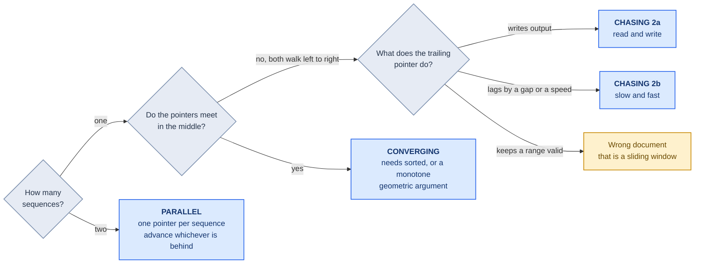
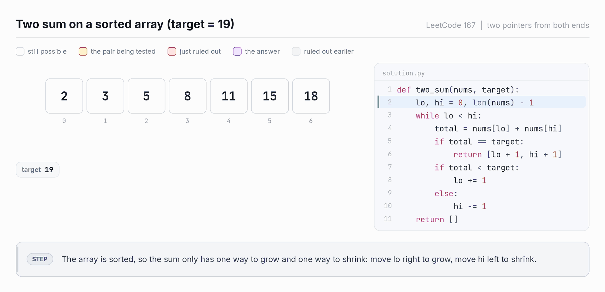
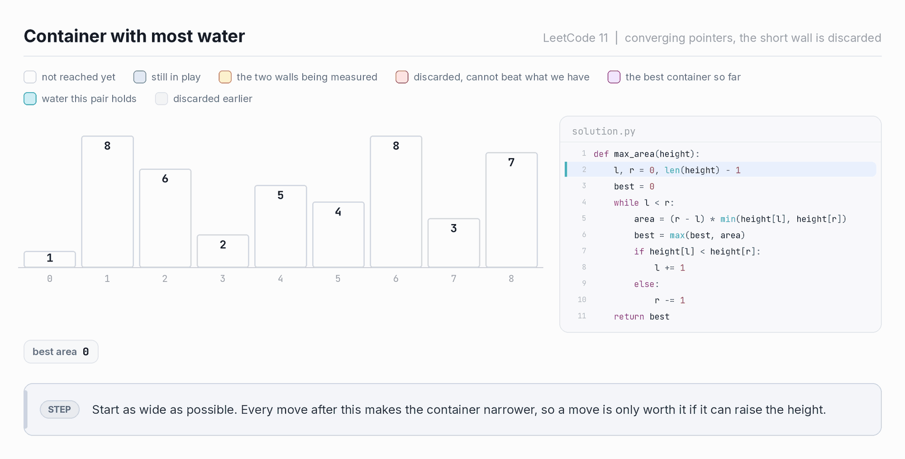
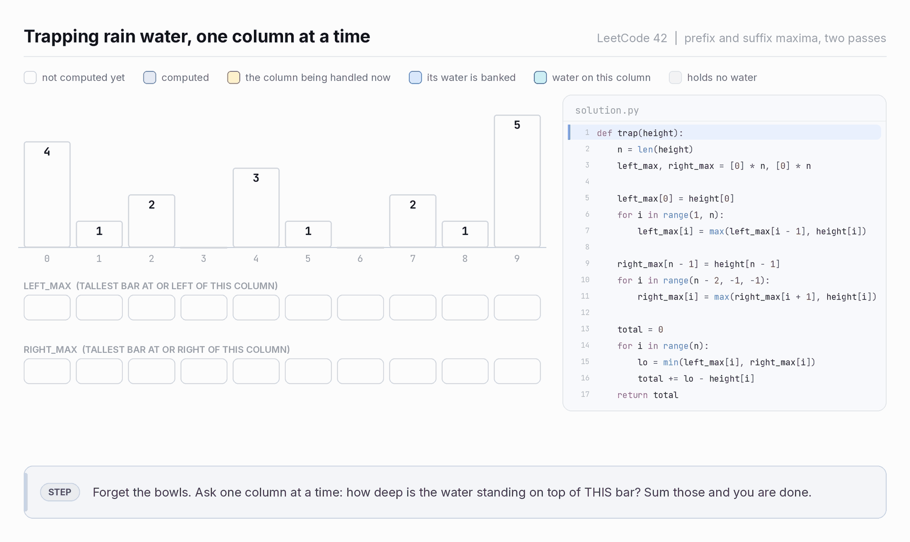
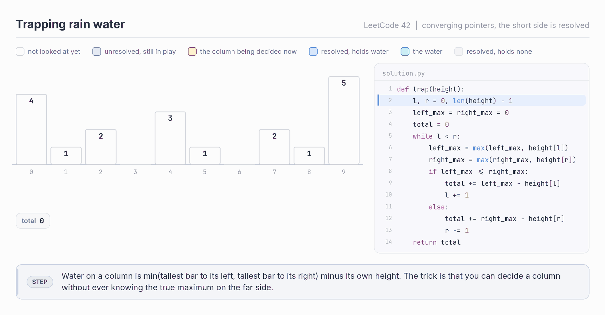
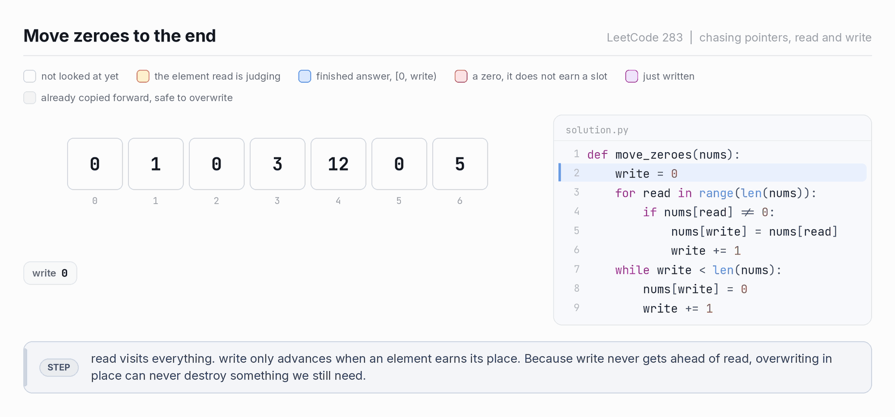
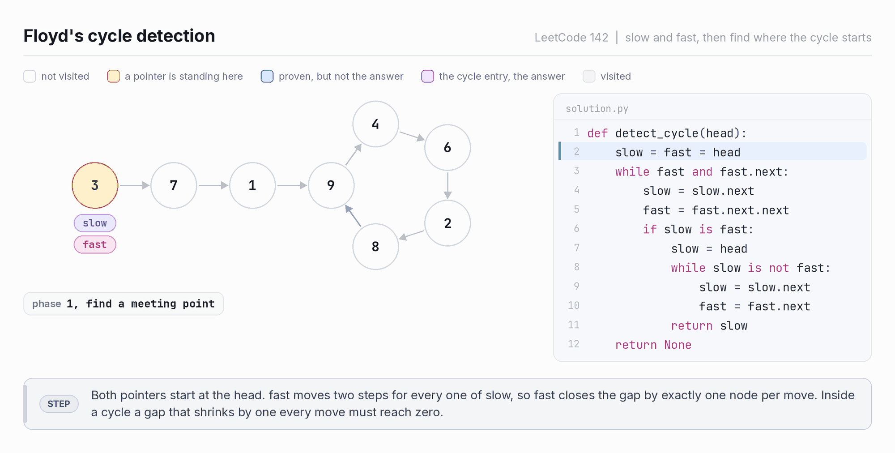
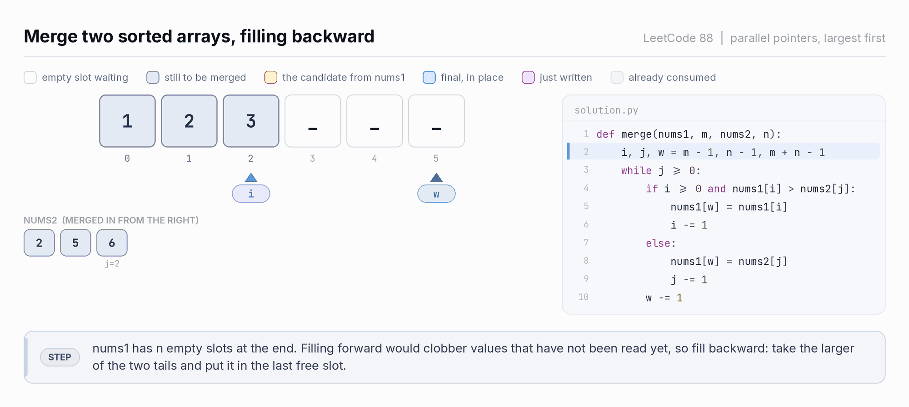
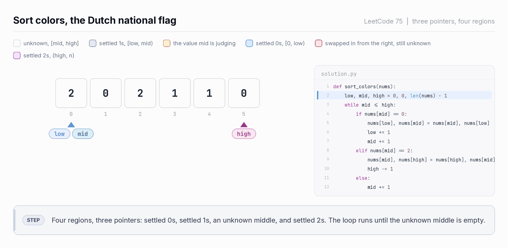

# Two Pointers

Two indices walking an array, each move throwing away a chunk of the search space you
have proven worthless.

Three shapes, and you can tell them apart from the first line of the problem statement.

```
CONVERGING     start at both ends, walk inward
               -->                       <--
               [ 2, 7, 11, 15, 19, 24, 31 ]

CHASING        both start left, one lags behind
               -->  -->
               [ 0, 1, 0, 3, 12 ]
                w   r

PARALLEL       one pointer per sequence, advance whichever is behind
               a: [ 1, 3, 5 ]   -->
               b: [ 2, 3, 8 ]   -->
```

---

## Contents

- [The one idea](#the-one-idea)
- [Which shape](#which-shape)
- [Shape 1: converging](#shape-1-converging)
  - [Two Sum II (LC 167)](#two-sum-ii-lc-167)
  - [Container With Most Water (LC 11)](#container-with-most-water-lc-11)
  - [Trapping Rain Water (LC 42)](#trapping-rain-water-lc-42)
  - [3Sum (LC 15)](#3sum-lc-15)
- [Shape 2: chasing](#shape-2-chasing)
  - [2a. Read and write](#2a-read-and-write)
  - [2b. Slow and fast](#2b-slow-and-fast)
- [Shape 3: parallel](#shape-3-parallel)
- [When two pointers breaks](#when-two-pointers-breaks)
- [Pitfalls](#pitfalls)
- [Drills](#drills)
- [Reference card](#reference-card)

---

## The one idea

Brute force on a pair problem is O(n²): try every `(i, j)`. Two pointers does it in
`n` moves instead of `n²`.

That only works if each move eliminates roughly `n` candidates at once.

So there is exactly one question to answer before you move a pointer:

> What did I just prove worthless?

If you cannot name it, you do not have a two pointers problem yet.

### Relation to sliding window

A sliding window is a chasing pair where the trailing pointer restores an invariant
instead of writing output. If both pointers move forward and the range between them
means something, you are in [SlidingWindow.md](SlidingWindow.md) instead.

---

## Which shape



| Shape | Loop condition | Cost | Precondition |
|---|---|---|---|
| Converging | `while l < r` | O(n) after sorting | sorted, or a monotone geometric argument |
| Chasing | `for read in range(n)` | O(n) | none |
| Parallel | `while i < len(a) and j < len(b)` | O(n + m) | both sorted |

---

## Shape 1: converging

Two pointers start at the ends and walk toward each other. Each iteration either records
an answer or discards one endpoint forever.

```
[ a b c d e f g ]
  l           r
      search space only shrinks, never expands
```

### Template

```python
l, r = 0, len(a) - 1
while l < r:
    if too_small(a[l], a[r]):
        l += 1              # a[l] is worthless, name why
    elif too_big(a[l], a[r]):
        r -= 1
    else:
        record(l, r)
        l += 1
        r -= 1
```

`l < r`, not `l <= r`, because a pair needs two distinct indices.

---

### Two Sum II (LC 167)

Sorted array, find the pair summing to `target`.

```
[ 2, 7, 11, 15 ]   target = 9
  l           r     2 + 15 = 17, too big
```

`15` is the largest value left. Paired with the smallest thing available (`2`) it is
still too big, so `15` is too big for everything. The whole column of pairs containing
`15` dies in one move.

```
[ 2, 7, 11, 15 ]
  l       r         2 + 11 = 13, too big, kill 11 the same way
[ 2, 7, 11, 15 ]
  l   r             2 + 7 = 9, found it
```

Three moves, not sixteen. Sorting is what licenses the argument.



*Every red cell is a value proved worthless. Three moves instead of sixteen pairs.*

```python
def two_sum(numbers: list[int], target: int) -> list[int]:
    l, r = 0, len(numbers) - 1
    while l < r:
        s = numbers[l] + numbers[r]
        if s == target:
            return [l + 1, r + 1]       # problem is 1-indexed
        if s < target:
            l += 1
        else:
            r -= 1
    return []
```

Two Sum (LC 1) and Two Sum II (LC 167) are the same question with different
preconditions, and they have different right answers. Unsorted input wants a hash map in
O(n). Sorting it just to run two pointers makes it O(n log n) for nothing.

---

### Container With Most Water (LC 11)

Area between two walls is `(r - l) * min(h[l], h[r])`.

```
      |           |
      |     |     |
   |  |     |  |  |
   l              r
```

If `h[l] < h[r]`, no pair using `l` can ever beat what you just measured. Width only
shrinks from here, and height is already capped by `h[l]`. So `l` dies.



*The cyan rectangle is the container. It gets narrower every single step, so the only
thing that can make up for the lost width is a taller short wall.*

```python
def max_area(height: list[int]) -> int:
    l, r = 0, len(height) - 1
    best = 0
    while l < r:
        best = max(best, (r - l) * min(height[l], height[r]))
        if height[l] < height[r]:
            l += 1
        else:
            r -= 1
    return best
```

---

### Trapping Rain Water (LC 42)

#### Stop filling bowls

The picture is what makes this hard. You see puddles sitting in grooves and try to fill
a groove at a time, which goes nowhere: a groove has no clean definition, and its walls
are two bars you have not found yet.

Fill **columns** instead. Stand on bar `i` and ask one question: how deep is the water
right here?

```
water(i) = min( tallest bar at or left of i , tallest bar at or right of i ) - height[i]
```

`min` is the whole physics: water spills over the lower side, so the **shorter side
decides** the depth and the taller side is irrelevant.

Columns are independent. Sum them and you are done. That one move turns a geometry
puzzle into a scan.

#### Two passes, and write this one first

Both maxima are prefix problems, so precompute them.

```python
def trap(height: list[int]) -> int:
    n = len(height)
    left_max, right_max = [0] * n, [0] * n

    left_max[0] = height[0]
    for i in range(1, n):
        left_max[i] = max(left_max[i - 1], height[i])

    right_max[n - 1] = height[n - 1]
    for i in range(n - 2, -1, -1):
        right_max[i] = max(right_max[i + 1], height[i])

    total = 0
    for i in range(n):
        lo = min(left_max[i], right_max[i])
        total += lo - height[i]
    return total
```

O(n) time, O(n) space, nothing clever. In an interview write this first, get it right,
then optimize out loud.



*Two sweeps build the arrays, then each column is settled on its own. Watch the two
dashed lines in the third pass: the lower one is always the one that sets the depth.*

One property of those arrays matters, because the next version lives on it:

> `left_max` never decreases as `i` moves right, `right_max` never decreases as `i`
> moves left. Both only ever climb.

#### Dropping the arrays

Same per-column answer, nothing stored.

Standing at `l`, `left_max` is exact: you have seen every bar from `0` to `l`. But
`right_max` covers only what you have seen from `r` inward, so it is a **lower bound**
on the true right maximum for `l`. Taller bars may hide in the unvisited middle.

You do not need the true value. If `left_max <= right_max`:

```
true right max for l   >=  right_max   >=  left_max

so   min(left_max, true right max)  =  left_max
```

The `min` collapses onto the side you already know exactly, so column `l` is final. Bank
it, move `l`, and the unknown middle never mattered. When `right_max < left_max` the
mirror argument decides column `r`.

```
 idx     0   1   2   3   4   5   6   7   8   9
 nums  [ 4   1   2   0   3   1   0   2   1   5 ]
             ^                           ^
             l                           r

         \___/                           \___/
         left_max is exact               right_max is exact
             \___________________________/
             never visited, and never needed
```

```python
def trap(height: list[int]) -> int:
    l, r = 0, len(height) - 1
    left_max = right_max = 0
    total = 0

    while l < r:
        left_max = max(left_max, height[l])
        right_max = max(right_max, height[r])

        if left_max <= right_max:
            total += left_max - height[l]    # l's water is decided
            l += 1
        else:
            total += right_max - height[r]   # r's water is decided
            r -= 1

    return total
```



*Same array, same answer, no arrays kept. The slate columns in the middle are still
unknown while their neighbours are already banked, which is the point.*

#### Two shorter-side arguments, two different moves

| Problem | Why move the shorter side |
|---|---|
| Container With Most Water | the short wall caps every pair it belongs to, so discard it |
| Trapping Rain Water | the short side is exact and binding, so that column is already final |

Container eliminates. Trapping resolves. Saying which one you are doing is most of the
follow-up answer.

---

### 3Sum (LC 15)

Fix one element, run a converging pair on the rest.

```python
def three_sum(nums: list[int]) -> list[list[int]]:
    nums.sort()
    n, res = len(nums), []

    for i in range(n - 2):
        if nums[i] > 0:
            break                                  # rest is positive, no zero sum
        if i > 0 and nums[i] == nums[i - 1]:
            continue                               # skip duplicate anchors

        l, r = i + 1, n - 1
        while l < r:
            s = nums[i] + nums[l] + nums[r]
            if s < 0:
                l += 1
            elif s > 0:
                r -= 1
            else:
                res.append([nums[i], nums[l], nums[r]])
                l += 1
                r -= 1
                while l < r and nums[l] == nums[l - 1]:
                    l += 1                         # skip duplicate seconds
                while l < r and nums[r] == nums[r + 1]:
                    r -= 1                         # skip duplicate thirds

    return res
```

Three separate duplicate skips, in three different places. Missing any one gives
duplicate triplets, and it is the most common 3Sum bug by a wide margin.

The skips for `l` and `r` go after recording, never before. See the pitfalls section.

---

### Converging problems

| LC | Title | Diff | Freq | Note |
|---|---|---|---|---|
| 167 | Two Sum II | Med | 🔥🔥🔥 | the base case, 1-indexed output |
| 15 | 3Sum | Med | 🔥🔥🔥 | three duplicate skips |
| 16 | 3Sum Closest | Med | 🔥🔥 | track the best diff, never return early |
| 18 | 4Sum | Med | 🔥 | recurse down to kSum, two pointers at the base |
| 11 | Container With Most Water | Med | 🔥🔥🔥 | shorter wall is discarded |
| 42 | Trapping Rain Water | Hard | 🔥🔥🔥 | shorter side is resolved |
| 125 | Valid Palindrome | Easy | 🔥🔥 | skip non-alphanumeric on both sides |
| 680 | Valid Palindrome II | Easy | 🔥🔥 | on mismatch, try skipping left OR right |
| 75 | Sort Colors | Med | 🔥🔥🔥 | three pointers, see pitfalls |
| 977 | Squares of a Sorted Array | Easy | 🔥🔥 | biggest square is at an end, fill backward |
| 344 | Reverse String | Easy | 🔥 | the smallest possible instance |

---

## Shape 2: chasing

Both pointers move left to right, and one lags. Two flavors, worth keeping apart.

| | The lag is | The trailing pointer | Typical problem |
|---|---|---|---|
| 2a | conditional | writes output | in-place array surgery |
| 2b | fixed, a gap or a speed ratio | measures distance | linked list structure |

---

### 2a. Read and write

`read` visits every element. `write` only advances when an element earns its spot.

The array is always in three regions:

```
[ kept  kept  kept | scrap | unseen unseen unseen ]
                   ^       ^
                 write    read

  [0, write)      finished answer, correct and final
  [write, read)   already copied forward, safe to overwrite
  [read, n)       not looked at yet
```

`write <= read` always holds, which is exactly why overwriting in place never destroys
data you still need. That inequality is the whole safety proof.



*The gap between the two pointers is exactly the number of elements discarded so far.
Everything the gap covers has already been copied forward, so it is free to overwrite.*

```python
write = 0
for read in range(len(a)):
    if keep(a[read]):
        a[write] = a[read]
        write += 1
return write            # new length
```

#### One template, two problems

Remove duplicates from a sorted array, allowing each value at most `k` times. Remove
Duplicates from Sorted Array (LC 26) is `k = 1`. Remove Duplicates from Sorted Array II
(LC 80) is `k = 2`. Same code.

```python
def remove_duplicates(nums: list[int], k: int) -> int:
    write = 0
    for x in nums:
        if write < k or nums[write - k] != x:
            nums[write] = x
            write += 1
    return write
```

Read the condition as: keep `x` unless the slot `k` positions back *in the output*
already holds `x`. Comparing against the output rather than the input is what makes it
generalize to any `k`.

#### Read and write problems

| LC | Title | Diff | Freq | Note |
|---|---|---|---|---|
| 27 | Remove Element | Easy | 🔥🔥 | the plain write pointer |
| 26 | Remove Duplicates from Sorted Array | Easy | 🔥🔥🔥 | `k = 1` |
| 80 | Remove Duplicates from Sorted Array II | Med | 🔥🔥 | `k = 2`, same code |
| 283 | Move Zeroes | Easy | 🔥🔥🔥 | write survivors, then zero-fill the tail |
| 392 | Is Subsequence | Easy | 🔥🔥 | advance `j` always, `i` only on match |
| 443 | String Compression | Med | 🔥🔥 | write pointer plus a run counter |
| 905 | Sort Array By Parity | Easy | 🔥 | one pass, or converging with swaps |

---

### 2b. Slow and fast

Same family, but the lag is structural rather than conditional. Two ways to build it:

```
FIXED GAP        both move 1 step, always n apart
                 [ a -> b -> c -> d -> e ]
                   s         f              gap = 2
                 when f hits the end, s is n from the end     (LC 19)

SPEED RATIO      slow moves 1, fast moves 2
                 [ a -> b -> c -> d -> e ]
                   s    f
                        s         f
                             s         f
                 when f hits the end, s is at the middle      (LC 876)
                 inside a cycle, f gains 1 per step and must lap s   (LC 141)
```

#### Floyd's cycle detection (LC 142)

```python
def detect_cycle(head):
    slow = fast = head
    while fast and fast.next:
        slow, fast = slow.next, fast.next.next
        if slow is fast:                      # they met, so there is a cycle
            slow = head                       # reset one to the front
            while slow is not fast:
                slow, fast = slow.next, fast.next
            return slow                       # cycle entry point
    return None
```



*Phase 1 ends on a meeting, which only proves a cycle exists. The purple node is
the answer, and it is not where they met. Watch phase 2: one pointer restarts at the
head, both move one step at a time, and they arrive at the entry together.*

`while fast and fast.next` in that order. Reversing it throws on a null `fast`.

Why phase 2 works: if the tail before the cycle has length `a`, and they met `b` steps
into the cycle, then walking `a` more steps from the head and `a` more steps from the
meeting point lands both on the entry. Sketch it once, do not memorize the algebra.

#### Floyd on an array

Floyd is not a linked list algorithm. It works on any function `f: state -> state` over
a finite state space, because a walk through finitely many states has to repeat
eventually.

An array hands you such a function for free whenever every value is a valid index:

```
f(i) = nums[i]

nums = [1, 3, 4, 2, 2]

   0 -> 1 -> 3 -> 2 -> 4 -> 2 -> 4 -> ...
                  \___________/
                  the cycle, entered at index 2
```

The duplicate value is the cycle entry, so Find the Duplicate Number (LC 287) is Floyd
verbatim with `slow = nums[slow]` and `fast = nums[nums[fast]]`.

One thing this is not: negative marking. Find All Duplicates in an Array (LC 442) and
Find All Numbers Disappeared in an Array (LC 448) flip the sign of `nums[abs(x) - 1]` to
record a visit. No second pointer, no cycle, no traversal. That belongs with
index-as-hash. The two tricks get confused because they share one precondition, "values
are valid indices," but they do completely different things with it.

#### Slow and fast problems

| LC | Title | Diff | Freq | Note |
|---|---|---|---|---|
| 141 | Linked List Cycle | Easy | 🔥🔥🔥 | phase 1 only |
| 142 | Linked List Cycle II | Med | 🔥🔥🔥 | phase 2 is the actual interview question |
| 876 | Middle of the Linked List | Easy | 🔥🔥 | which middle for even length? ask first |
| 19 | Remove Nth Node From End of List | Med | 🔥🔥🔥 | fixed gap, use a dummy head |
| 234 | Palindrome Linked List | Easy | 🔥🔥 | find middle, reverse half, then converge |
| 143 | Reorder List | Med | 🔥🔥 | middle, reverse, merge, three sub-skills in one |
| 287 | Find the Duplicate Number | Med | 🔥🔥 | Floyd on `f(i) = nums[i]` |
| 202 | Happy Number | Easy | 🔥 | Floyd on digit-square-sum, same idea |

---

## Shape 3: parallel

Two sorted sequences, one pointer each. Compare the heads, consume the smaller. Nothing
converges and nothing lags.

```
a: [ 1, 3, 5, 7 ]      i
b: [ 2, 3, 8 ]         j
```

```python
i = j = 0
while i < len(a) and j < len(b):
    if a[i] < b[j]:
        i += 1
    elif a[i] > b[j]:
        j += 1
    else:
        record(a[i])
        i += 1
        j += 1
```

Rearrange those three branches and you get set intersection, set difference, the merge
step of merge sort, or interval overlap. Same skeleton every time.

### Merge Sorted Array (LC 88), backward

The problem gives you `nums1` with `n` empty slots at the end. Filling forward clobbers
values you have not read yet. Filling backward cannot, because the write position stays
ahead of both read positions.



*`w` is always to the right of `i`. That is the entire reason this is safe, and it is
why the forward version is not.*

```python
def merge(nums1: list[int], m: int, nums2: list[int], n: int) -> None:
    i, j, w = m - 1, n - 1, m + n - 1
    while j >= 0:                                   # nums2 must be fully drained
        if i >= 0 and nums1[i] > nums2[j]:
            nums1[w] = nums1[i]
            i -= 1
        else:
            nums1[w] = nums2[j]
            j -= 1
        w -= 1
```

The loop condition is `j >= 0` alone. If `nums1` runs out first, the rest of `nums2`
still needs copying. If `nums2` runs out first, whatever remains in `nums1` is already
sitting in the right place.

### Parallel problems

| LC | Title | Diff | Freq | Note |
|---|---|---|---|---|
| 88 | Merge Sorted Array | Easy | 🔥🔥🔥 | fill backward |
| 350 | Intersection of Two Arrays II | Easy | 🔥🔥 | keep multiplicity, follow-up is about disk |
| 349 | Intersection of Two Arrays | Easy | 🔥 | dedupe on output |
| 986 | Interval List Intersections | Med | 🔥🔥 | overlap is `max(starts)` to `min(ends)` |
| 4 | Median of Two Sorted Arrays | Hard | 🔥🔥 | O(n) merge is the warmup, O(log n) is binary search |
| 524 | Longest Word in Dictionary through Deleting | Med | 🔥 | subsequence check in a loop |
| 1768 | Merge Strings Alternately | Easy | 🔥 | trivial, good warmup |

---

## When two pointers breaks

| Situation | Why it fails | Go to |
|---|---|---|
| Unsorted array, find a pair summing to target | no ordering, so no discard argument | hash map, Two Sum (LC 1) |
| You cannot name what a move eliminates | no proof, just hope | brute force, then hunt for structure |
| Need max or min of a moving range | pointers do not track that | monotonic deque |
| Need the k-th smallest across many sequences | parallel pointers costs O(k) per pull | heap |
| Answer is a contiguous range under a constraint | wrong pattern | sliding window |
| Pairs must satisfy two independent orderings | one axis of movement is not enough | sort by one, BIT or segment tree on the other |

The test never changes. Before moving a pointer, finish this sentence out loud: "every
pair I am skipping is worthless because ___." A blank means stop.

---

## Pitfalls

### `l < r` versus `l <= r`

Pairs need distinct indices, so `l < r`. Palindromes also use `l < r`, since a lone
middle character is trivially a palindrome. `l <= r` belongs to binary search, which is
a different pattern.

### 3Sum, skipping duplicates in the wrong place

```python
# WRONG: skips before recording, loses valid triplets
while l < r and nums[l] == nums[l + 1]:
    l += 1
res.append(...)

# RIGHT: record first, then skip past the run
res.append(...)
l += 1
r -= 1
while l < r and nums[l] == nums[l - 1]:
    l += 1
```

Test both on `[-2, 0, 0, 2, 2]`. The answer is one triplet, `[-2, 0, 2]`. The wrong
version finds zero.

### Sort Colors (LC 75), three pointers and one asymmetry

Dutch national flag keeps four regions with three pointers.

```
[ 0s | 1s | unknown | 2s ]
      ^    ^       ^
     low  mid     high
```

```python
def sort_colors(nums: list[int]) -> None:
    low, mid, high = 0, 0, len(nums) - 1
    while mid <= high:
        if nums[mid] == 0:
            nums[low], nums[mid] = nums[mid], nums[low]
            low += 1
            mid += 1
        elif nums[mid] == 2:
            nums[mid], nums[high] = nums[high], nums[mid]
            high -= 1                  # do NOT advance mid
        else:
            mid += 1
```



*The white region is the unknown middle. Watch `mid` after a swap: it steps forward on a
`0` and stays put on a `2`.*

`mid` advances after a `0` swap but not after a `2` swap. The value arriving from the
left has already been examined, so stepping over it is safe. The value arriving from the
right never has. Getting this backward is the classic failure, and it still passes the
sample input.

Also `mid <= high`, with the equals, because `high` still points at an unexamined cell.

### Merging forward when you should merge backward

Merge Sorted Array (LC 88) filled forward destroys `nums1[0]` before you read it. Any
time the output shares storage with an input, fill from the back.

### Fast pointer null check order

```python
while fast and fast.next:       # right
while fast.next and fast:       # throws
```

### Valid Palindrome II (LC 680), one skip, either side

On a mismatch you get exactly one deletion, and it might belong on either side.

```python
if s[l] != s[r]:
    return is_pal(s, l + 1, r) or is_pal(s, l, r - 1)
```

Greedily picking a side fails on `"abca"`.

### Returning the array instead of the length

Remove Element (LC 27), Remove Duplicates from Sorted Array (LC 26), and Remove
Duplicates from Sorted Array II (LC 80) all want a length back, with the first `k` slots
of the input mutated in place. Returning a fresh list scores zero even when the values
are right.

---

## Drills

Answer without running code.

1. Container With Most Water and Trapping Rain Water both move the shorter side. State
   each reason in one sentence, and say which is elimination and which is resolution.
2. In Trapping Rain Water, `right_max` is only a lower bound on the true right maximum.
   Explain in one sentence why the answer comes out exact anyway.
3. Two Sum is O(n) with a hash map. Two Sum II is O(n) with two pointers. What changed,
   and why does the hash map not simply win both?
4. Delete `if i > 0 and nums[i] == nums[i-1]: continue` from 3Sum. Give an input that now
   returns a duplicate triplet.
5. In Sort Colors, move the `mid += 1` from the `0` branch into the `2` branch. Find the
   shortest input that breaks.
6. Floyd resets `slow` to the head in phase 2. Why the head, and not the meeting point?
7. Find the Duplicate Number uses Floyd. Find All Duplicates in an Array uses negative
   marking. Name the property both rely on, and the reason only one of them is a two
   pointers problem.

---

## Reference card

```
BEFORE MOVING A POINTER, NAME WHAT YOU KILLED.
No sentence, no two pointers.

CONVERGING     l, r = 0, n-1 ;  while l < r
               needs sorted, or a monotone geometric argument
               167 Two Sum II            15  3Sum
               11  Container With Water  42  Trapping Rain Water
               125 Valid Palindrome      75  Sort Colors
               977 Squares of a Sorted Array

CHASING 2a     read / write, the lag is conditional
               [0,write) done | [write,read) scrap | [read,n) unseen
               26  Remove Duplicates     27  Remove Element
               80  Remove Duplicates II  283 Move Zeroes
               392 Is Subsequence        443 String Compression

CHASING 2b     slow / fast, the lag is a gap or a speed ratio
               141 Linked List Cycle     142 Linked List Cycle II
               876 Middle of the List    19  Remove Nth From End
               234 Palindrome List       287 Find the Duplicate Number

PARALLEL       one pointer per sorted sequence, consume the smaller
               88  Merge Sorted Array    350 Intersection of Two Arrays II
               986 Interval List Intersections
               4   Median of Two Sorted Arrays

WATCH OUT      l < r, never l <= r, except in binary search
               3Sum needs three separate duplicate skips
               Sort Colors advances mid on the 0 swap only
               in-place merge fills backward
               Valid Palindrome II must try both skips
```
