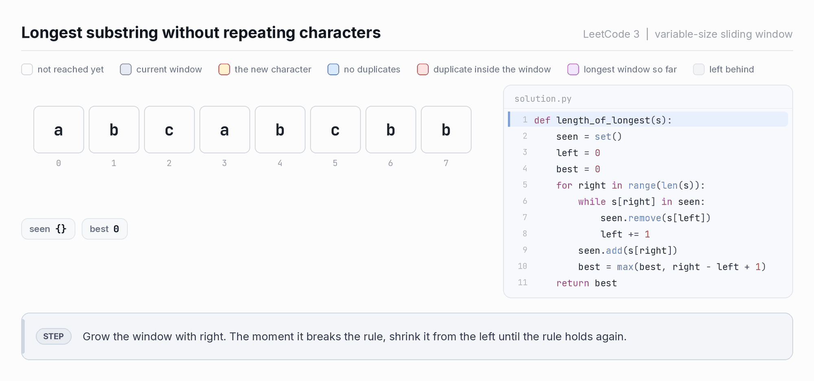

# anim — animation generator for the tutorials

Renders looping GIFs that step through an algorithm one decision at a time:
array cells on the left, the actual Python source on the right with the current
line highlighted, and a plain-English caption at the bottom explaining *why*
that step happened.

Output goes to `tutorials/assets/<pattern>/<slug>.gif`. GIFs play inline in
GitHub READMEs, Markdown tutorials, Notion and most blog engines, so a tutorial
just needs:

```markdown

```

## Running it

```bash
cd tutorials/anim
python3 -m venv .venv && source .venv/bin/activate
pip install -r requirements.txt

python3 render_all.py              # everything -> ../assets/
python3 render_all.py --list       # what exists
python3 render_all.py --only lc0003 --png    # one animation + stills
python3 render_all.py --speed 1.4  # 40% faster playback
```

Nothing here is imported by `tracker/`. The app stays stdlib-only; this is a
build-time tool for authoring content.

## Adding a new animation

Write the algorithm normally, then sprinkle `t.snap(...)` calls at the moments a
reader needs to see. Each snap is one frame.

```python
from ..model import Tracer, window_roles

CODE = """
def solve(nums):
    ...
"""

def my_problem(nums=(1, 2, 3)):
    t = Tracer(nums, "Title of the animation",
               "LeetCode 123  |  pattern name", CODE, slug="lc0123-my-problem")
    t.snap(window_roles(len(nums), lo, hi, focus=i),
           line=4,                                   # 1-based line in CODE
           note="Why this step happens, in one sentence.",
           verdict="valid",                          # colours the caption bar
           pointers=[("left", lo), ("right", hi)],
           bracket=(lo, hi, "len 3"),
           state=[("best", "3")],
           hold=1.4)                                 # 1.0 = ~0.9s on screen
    return t.trace
```

Then add the function to `REGISTRY` in `render_all.py`.

### The vocabulary the frames use

Every frame carries a key row under the title, built automatically from the
roles that animation actually uses, so a GIF still teaches when it is embedded
somewhere on its own.

The palette rests on one opposition:

- **blue** = passes, valid, kept
- **red** = fails, violates, discarded

Red against blue stays readable for the common forms of colour blindness, which
red against green does not. Everything else deliberately sits off that axis so
it can never be mistaken for a verdict:

| role | colour | meaning |
| --- | --- | --- |
| `idle` | white | not visited yet |
| `dim` | light grey | scanned and left behind |
| `window` | slate | in the window / in the live search space, no judgement yet |
| `focus` | amber | the element being examined right now |
| `valid` | blue | passes the constraint |
| `invalid` | red | breaks the constraint, or is being thrown away |
| `best` | purple | part of the best answer so far |

| verdict | caption bar |
| --- | --- |
| `info` | STEP, grey. Setup or a framing sentence |
| `valid` | VALID, blue |
| `invalid` | VIOLATION, red |
| `drop` | DISCARD, red. Something was thrown away on purpose |
| `record` | NEW BEST, purple. The answer improved |
| `count` | COUNTED, purple. Windows were added to a running count |

Pointer pills are coloured by name and stay off the verdict axis too:
`left`/`lo`/`i` indigo, `right`/`hi`/`j` pink, `mid` teal.

### Wording the key row

The roles are generic; the words should not be. Pass a `legend` dict to
`Tracer` and say what the colour means *in this problem*:

```python
t = Tracer(nums, "Binary search", "LeetCode 704", CODE, slug="lc0704",
           legend={"window": "still possible",
                   "focus": "mid, the probe",
                   "invalid": "ruled out by this probe",
                   "best": "found it",
                   "dim": "ruled out earlier"})
```

Any role you leave out falls back to a generic label from
`theme.DEFAULT_LEGEND`. Set a role to `""` to hide it from the key. Roles the
animation never uses are dropped automatically, so the row stays short.

### Resolution

GIF has no DPI. A viewer scales the file's pixels to whatever width the page
gives it, so the only thing that matters is having enough pixels for the width
it will be shown at. On a HiDPI screen a 1000px image rendered into an 880px
column needs 1760 real pixels, and anything less looks soft.

So `Layout` has two numbers:

- `scale` (default 3) is supersampling. Everything is drawn at 3x and
  downsampled, which is what makes the text edges and rounded corners smooth.
- `export` (default 2) is how many output pixels each design pixel becomes. At
  the default 1000-pixel design width that ships a 2000-pixel-wide GIF, sharp in
  a GitHub README on a retina display.

Dropping to `Layout(export=1)` roughly halves the file size and is fine if the
target is a small embed. Going past `export=2` is wasted bytes: no display asks
for more, and GIF's 256-colour palette is the quality ceiling long before
resolution is.

### Extras

- Three ways to draw the data. **Cells** is the default. **Bars** turns the row
  into a histogram: pass `bars=[(height, water), ...]`, plus optional
  `hlines=[(value, label, colour)]` for dashed reference lines (LC 42's
  `left_max` and `right_max`) and `region=(lo, hi, height, label)` for a filled
  rectangle behind the bars (LC 11's container). **Graph** draws a rho-shaped
  linked list: pass `graph=(node_count, tail_length)` to `Tracer` and the
  renderer lays out a straight tail into a polygon cycle, with pointer labels
  placed radially outward.
- `cells=` on a snap overrides the displayed values. In-place algorithms that
  mutate the array (LC 75, LC 283, LC 88) need this, or every frame shows the
  original input.
- `Aux` rows draw a second structure under the array. `kind="cells"` for a stack
  or deque (free width), `kind="aligned"` for a per-index row that lines up with
  the array above (prefix sums, an answer array), `kind="chips"` for a hash map.
- `hold` stretches a frame. Use it on the two or three frames that carry the
  idea, so the loop breathes instead of flickering.
- Frame size adapts to content: no aux rows means a shorter canvas.

## Layout

```
dsaviz/
  theme.py      colours, fonts, spacing
  model.py      Frame / Trace / Tracer, window_roles helper
  draw.py       drawing primitives, Python syntax highlighting
  render.py     Frame -> PIL image, shared-palette GIF writer
  fonts/        Inter + JetBrains Mono (SIL OFL, bundled for reproducible output)
  patterns/     one module per pattern, the instrumented algorithms
render_all.py
```

The GIF writer builds one palette covering every frame and writes with
`disposal=1`, so frames store only what changed. That keeps a 30-frame
animation around 300 KB instead of 1.2 MB.
